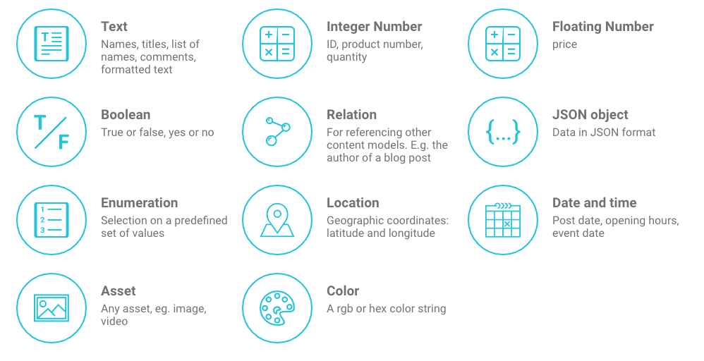

# Concepts
GraphCMSの概念の概要。

## Projects
コンテンツはプロジェクト内に存在します。プロジェクトでは次のことができます。

- `content models`を追加してコンテンツの形状を定義する
- modelに`fields`を追加する
- プロジェクトのコンテンツを管理して閲覧する
- メディアファイルのアップロードと割り当て
- あなたのチームに他の人を招待する
- あなたのチームの活動を追跡する
- アプリケーションとコンテンツのコンシューマ向けに`permanent auth tokens (永続的な認証トークン)`を作成する
- 統合されたGraphiQLプレイグラウンドを使用して、プロジェクトのエンドポイントに対してクエリと突然変異を実行する

## Content Models
コンテンツモデルは、コンテンツの形状を記述します。それらは複数のフィールドで構成され、各フィールドはさまざまなタイプのデータ（テキスト、数値、画像など）を格納できます。フィールドは、別のモデルへの参照でもあり、複雑なコンテンツグラフを作成することができます。モデルに関連付けるフィールドには、コンテンツ編集ユーザーインターフェイスの外観も定義されます。

## Fields
フィールドは、コンテンツモデルのビルディングブロックです。各フィールドタイプには、特定のタイプのデータを格納できます。 GraphCMSには、以下のフィールドタイプがあります。

- **Text:** names, titles, list of names, comments, formatted text, markdown...
- **Number:** ID, product number, price, quantity...
- **Boolean:** true or false, yes or no...
- **Date:** post date, opening hours, date of birth...
- **Enum:** selection on a predefined set of values  
Enum(列挙型)は、列挙子リストと呼ばれる名前付き定数の集まりで構成される固有の型  
> [enum (C# リファレンス)](https://docs.microsoft.com/ja-jp/dotnet/csharp/language-reference/keywords/enum)
- **JSON:** data in JSON format
- **Color:** rgba or hex color string
- **Location:** 地理座標：緯度と経度
- **Assets:** any asset, e.g. image, video...
- **Relation:** 他のコンテンツモデルを参照するためのものです。例えば。ブログ記事の作者

## Webhooks
Webhooksは、指定されたイベントの場合に独自のビジネスロジックを実行できる強力なコンセプトです。

GraphCMSでは、コンテンツモデルにトリガを定義できるため、コンテンツが変更された場合などにカスタムコードを実行できます。

詳細については、[webhooks section]()を参照してください。

## GraphQL Endpoints
どのGraphCMSプロジェクトにも、2つのGraphQLエンドポイントが付属しています。

- `simple endpoint`は、Apollo、Apollo iOS、LokkaなどのGraphQLクライアントで使用するための簡単なGraphQLスキーマでコンテンツを提供します
- `relay endpoint`は、[data driven react applications](https://facebook.github.io/relay/)(データ駆動型の反応アプリケーション)用のリレー適合GraphQLスキーマを使用してコンテンツを提供します

## Permanent Auth Tokens (恒久認証トークン)
クライアントアプリケーションをGraphCMSバックエンドに接続するには、`permanent auth tokens (永続的な認証トークン)`を作成する必要があります。これにより、外部クライアントは次のことが可能になります。

- `CREATE` : 新しいコンテンツエントリを作成する
- `READ` : 既存のコンテンツエントリを読み込む
- `UPDATE` : 既存のコンテンツエントリを更新する
- `DELETE` : 既存のコンテンツエントリを削除する

[How to work with permanent auth tokens]()

*注意してください！トークンの1つにアクセスすると、これらの操作をすべて実行してコンテンツを操作することができます。だから、クライアント側、すなわちJavaScriptクライアントアプリケーションにトークンを格納することは決して良い考えではありません。*

*私たちは間もなく、`read-only tokens (読み取り専用のトークン)`を作成できる機能をリリースする予定です。したがって、誰かがそのようなトークンにアクセスしても、データは操作から安全です*

*代わりに、作成、読み取り、更新、および削除操作（ここを参照）に対してパブリックアクセスを設定することもできます。これにより、トークンステップをスキップできます。*

## System Artifacts (システム成果物)
各GraphCMSプロジェクトには、ユーザが認識すべきいくつかのシステム成果物が付属しています。これらは、システムによって自動的に作成されるモデルおよびフィールドです。

### Asset Model
`Asset`システムモデルは、アップロードしたファイルを保存する場所です。アセットフィールドをコンテンツモデルのいずれかに割り当てるたびに、このモデルとの関係が作成されます。

`Asset`モデルのフィールドは次のとおりです。

- `fileName`ファイルの名前
- `handle` : ファイルの固有の識別子を処理する
- `url` : ファイルのパブリックURL。常にmedia.graphcms.com/`handle`です。
- `size` : ファイルのサイズ
- `mimeType` : ファイルのインターネット資産の種類
- `isPublic` : isPublicファイルがパブリックに使用可能かどうかを示すフラグです（現在は常にtrueです）。

