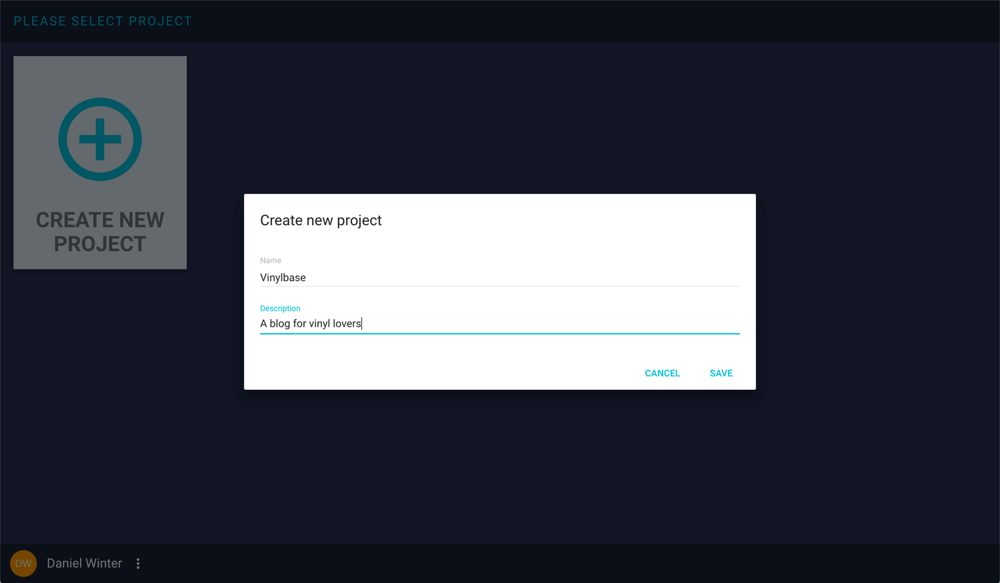
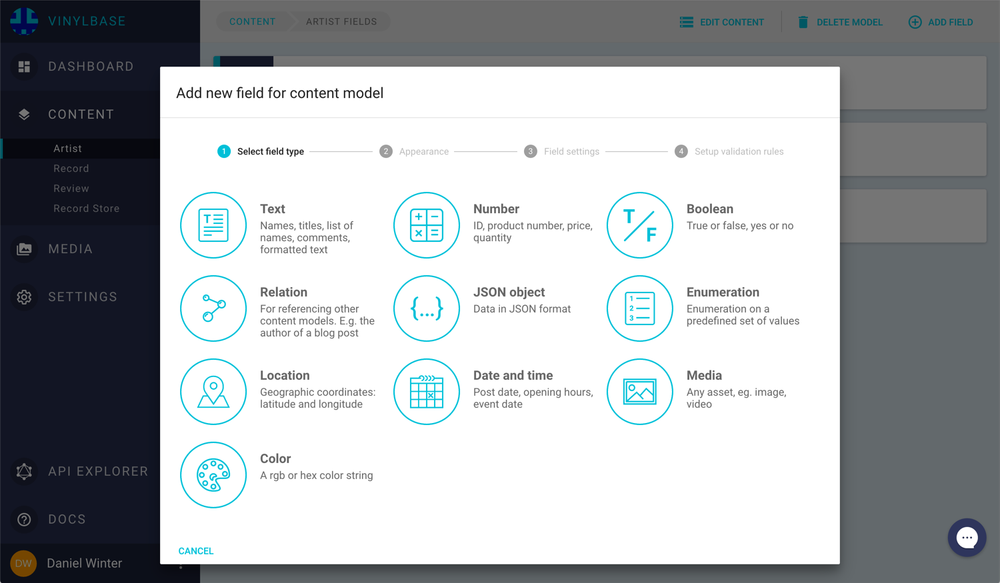
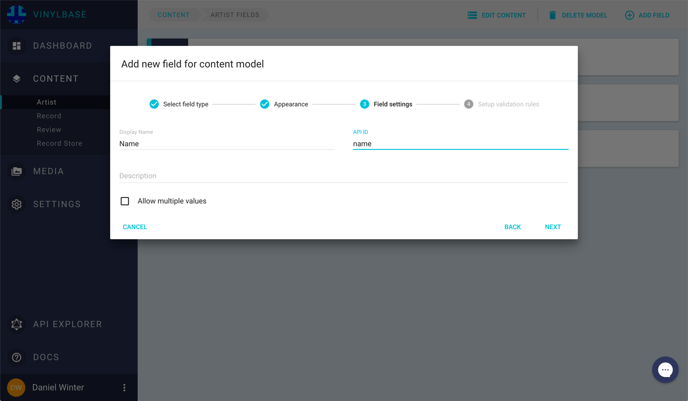
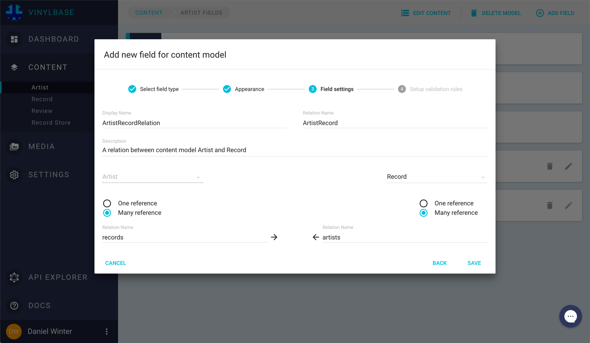
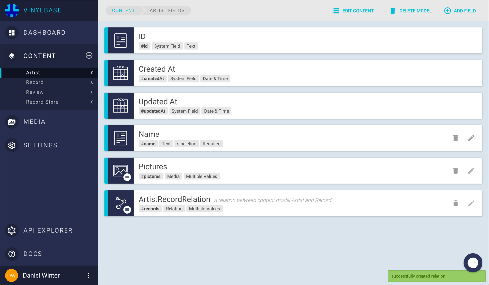
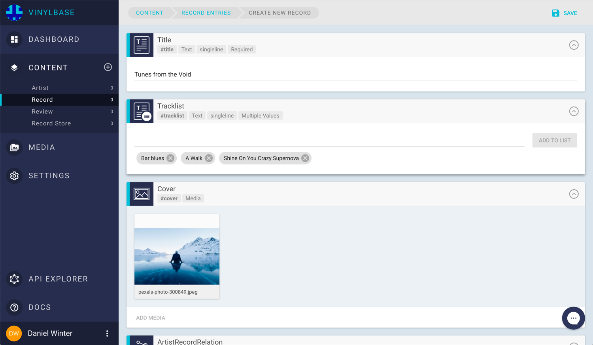
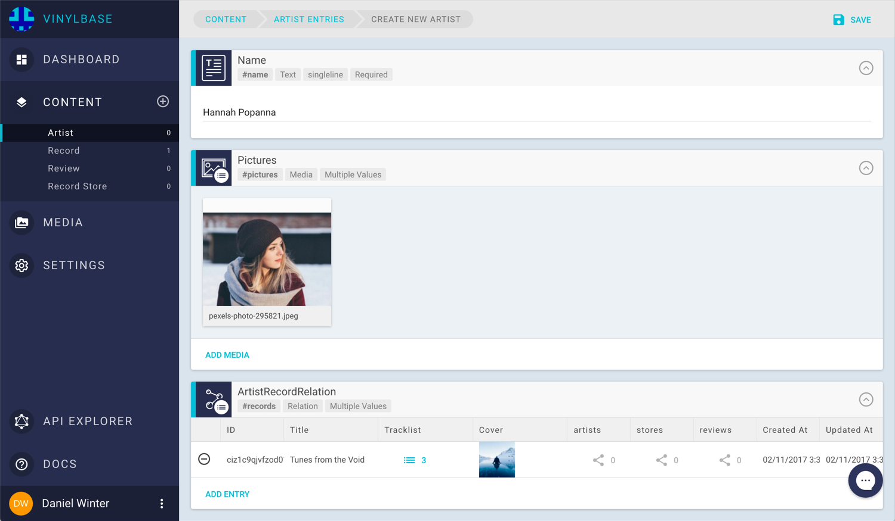
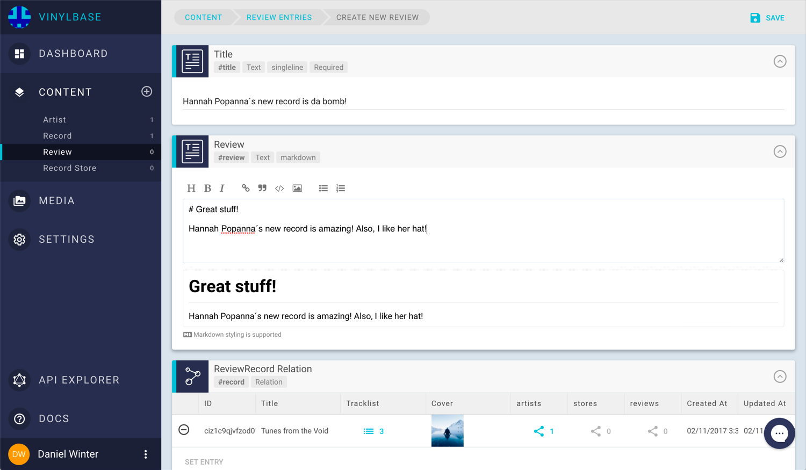
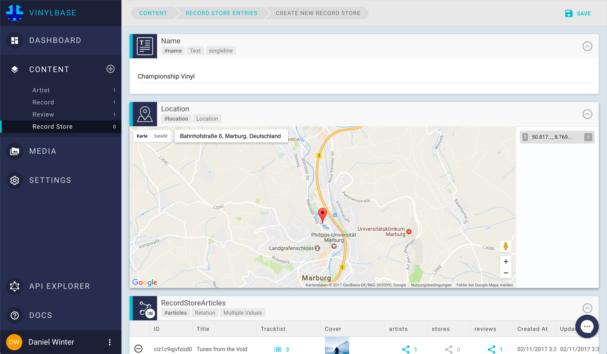
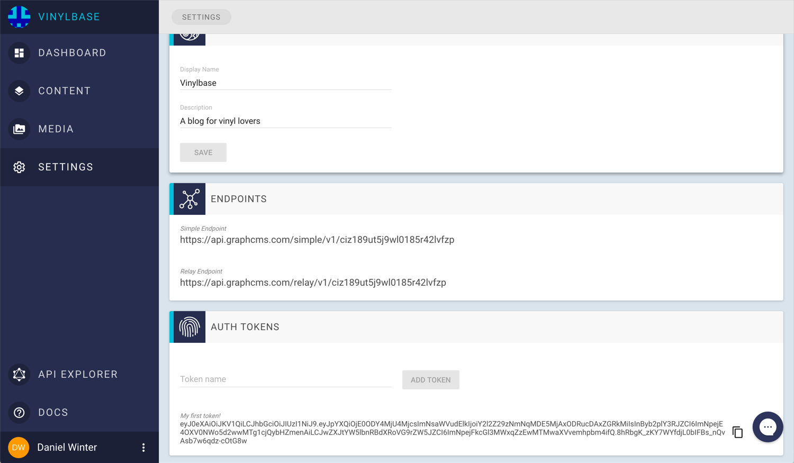

# Getting Started
GraphCMSでコンテンツAPIを構築するのは簡単です！この入門ガイドでは、音楽ブログ用のコンテンツAPIをすばやく作成する方法を紹介します。

## Creating a Project
まず、`Vinylbase`と呼ばれる新しいプロジェクトを作成します。



> プロジェクト名には、英数字と空白のみを使用できます。

## Creating Content Models
プロジェクトを作成した後、`CONTENT`ビューに切り替え、`ADD MODEL`ボタンを使用して次のモデルを追加します。

- `Artist`
- `Record`
- `Review`
- `Record Store`


> モデルのAPI IDは大文字で始まり、英数字のみを使用できます。空白は許されません。

## Adding Fields to your Content Models
コンテンツモデルにコンテンツを取り込む前に、それらにフィールドを追加する必要があります。これは、サイドバーのコンテンツモデルの横にある小さな歯車のアイコンをクリックするか、コンテンツモデルをクリックしてから、`EDIT FIELDS`ボタンをクリックして行います。

そうすると、`Field Wizard`が開きます。ここでは、コンテンツモデルに追加するフィールドのタイプ、外観、API識別子、および追加ルールを指定できます。



### Fields for model Artist
コンテンツモデル`Artist`の場合は、次の3つのフィールドを追加します。

- `Name`
- `Pictures`
- `Records`

`Name`については、`required`に応じて設定した`Single Line Text Field`を使用します。`Display Name`を使用すると、Webインターフェイスでフィールドをどのように表示するかを定義し、`API ID`でContent APIでフィールドの名前を指定する方法を定義します。



> ウェブインターフェースでは、API IDの先頭に＃が付いています（例：#name）。
> フィールドのAPI IDは小文字で始まり、英数字のみを使用できます。

フィールド`Pictures`では、アセットフィールドを追加して`Allow multiple values`をチェックします。これにより、任意の数のメディアファイルを保存できます。

このモデルに関係を追加します。 Relationsでは、2つのコンテンツモデルを接続できます。この場合、アーティストと既存のレコードを結びつけたいので、`ArtistRecord Relation`を作成します。リレーション名は、リレーションシップがコンテンツAPIでどのように指定されるかを定義します。



`Artist`は多くの`#records`を持つことができるように関係を設定しますが、反対に`Record`は`#artists`を多数持つこともできます。
 > 関係名は大文字で始まり、英数字のみを使用できます

 モデルに添付されているすべてのフィールドが表示されるようになりました。



> `ID`、`CreatedAt`、および`UpdatedAt`の3つの追加フィールドがあることに注意してください。これらはシステムフィールドであり、削除または変更することはできません。
> フィールドの順序を変更するには、左側のアイコンの項目をドラッグします。ここで定義する設定は、このコンテンツモデルのエントリを作成または編集できるエントリフォーム内の同じ順序です。

### Fields for model Record
このモデルは、音楽レコードのコンテンツを格納します。フィールドは次のようになります。

- Title `#title` `Single Line Text` `required`
- Tracklist `#tracklist` `Single Line Text` `Allow multiple values`
- Cover `#cover` `Asset`

このモデルのAPI ID `#artists`との関係フィールドに気付いた？このフィールドエントリは、前に作成した`ArtistRecord Relation`の`reverse side`にあるためです。 GraphQLコンテンツAPIを構築しているので、両方向にトラバースできる必要があります。

### Fields for model Review
コンテンツモデル`Review`では、次のフィールドを追加します。

- Title `#title` `Single Line Text` `required`
- Record `#record` `One-to-Many Relation on model Record`. これにより、モデル`Record`にもう1つの逆関係フィールドが追加されます。名前は`#reviews`です
- Review `#review` `Markdown Text`

### Fields for model Record Store
構成しようとしている最後のコンテンツモデルには、レコードストアとレコードの情報が格納されます。
フィールド構成：
- Name `#name` `Single Line Text` `required`
- Location `#location` `Location field`
- Articles `#articles` `Many-to-Many Relation on model Record`.これにより、モデル`Record`に`#stores`という別の逆関係フィールドが再度追加されます。

すばらしいです！これでコンテンツの作成が始まります。

## Creating Content
まず、`Record`タイプの`Content Entry`を追加します。サイドバーのモデルの横にある小さいプラスのアイコンをクリックするか、モデルをクリックしてから`NEW ENTRY`ボタンをクリックしてください。

### Creating a record
これで、入力フォーム要素を使用してコンテンツを取り込むことができました。入力フィールドの表示は、以前に行ったフィールド設定によって異なります。たとえば、`#cover`フィールドは`Asset`タイプなので、プロジェクトにメディアをアップロードしてレコードに添付することができます。


> アップロードする前に、アップロードウィジェット内で画像を切り抜くことができます。 アップロードされたファイルはすべてASSETセクションにあります。

### Creating an artist
次に、タイプ`Artist`の`Content Entry`を作成しましょう。私たちは`Record Entry`と同じ方法でこれを行います。この時間を除いて、リレーションフィールド`#records`にエントリを割り当てることができます。以前作成したレコードを割り当てましょう！



### Creating a review
Hannah Popannaの新しい記録にレビューを追加しましょう。ここでは、マークダウンエディタを使用して洗練された批評を書くことができます。



### Creating a record store
ほぼ完了！最後のステップでは、`Record Store`のエントリを作成します。場所を追加するには、マップウィジェットを使用できます。

クール。コンテンツの作成が完了したので、`API EXPLORER`のGraphQLコンテンツAPIを調べてみまし！。



## Exploring the Content API
`API EXPLORER`では、`simple`なGraphQLエンドポイントと`relay`エンドポイントを切り替えることができます。両方のエンドポイントは、プロジェクトのコンテンツをさまざまな方法で配信しています。今のところ、`simple`なエンドポイントを選択します。

統合されたGraphiQLエディタを使用して、GraphQLクエリで入力を開始できます。サーバーに次のクエリを送信します。

```json
{
  allRecordStores {
    name
    location
    articles {
      title
      cover {
        fileName
        url
      }
      tracklist
      artists {
        name
        pictures {
          url
          size
        }
      }
      reviews {
        title
        review
      }
    }
  }
}
```

Will respond with:

```json
{
  "data": {
    "allRecordStores": [
      {
        "name": "Championship Vinyl",
        "location": {
          "lat": 50.81655790000001,
          "lng": 8.76931209999998
        },
        "articles": [
          {
            "tracklist": [
              "Bar blues",
              "A Walk",
              "Shine On You Crazy Supernova"
            ],
            "cover": {
              "fileName": "pexels-photo-300849.jpeg",
              "url": "https://media.graphcms.com/2D1bXQZLTiGY6Uz8LUqB"
            },
            "artists": [
              {
                "name": "Hannah Popanna",
                "pictures": [
                  {
                    "url": "https://media.graphcms.com/kgxzNRIIQUanwoBugK5O",
                    "size": 3258909
                  }
                ]
              }
            ],
            "reviews": [
              {
                "title": "Hannah Popanna´s new record is da bomb!",
                "review": "# Great stuff!\n\nHannah Popanna´s new record is amazing! Also, I like her hat!"
              }
            ],
            "title": "Tunes from the Void"
          }
        ]
      }
    ]
  }
}
```

クール！フロントエンドアプリケーションの構築を開始できます。 「設定」メニューに切り替えて、エンドポイントURLを表示し、アプリケーションの永続認証トークンを作成します。[永続的な認証トークンの使用方法](https://graphcms.com/docs/guides/Using_permanent_auth_tokens/)を参照してください。



> 問題が発生した場合は、[問題追跡](https://github.com/GraphCMS/Issue-tracker)ツールの既知の問題を参照してください。トラッカーの問題でカバーされていない問題が発生した場合は、バグチケットを開くことをためらってください。
> 機能が不足している場合、または追加の機能についてのアイデアがある場合は、[機能要求リポジトリ](https://github.com/GraphCMS/Feature-Requests)に機能要求を提出することで改善してください。
